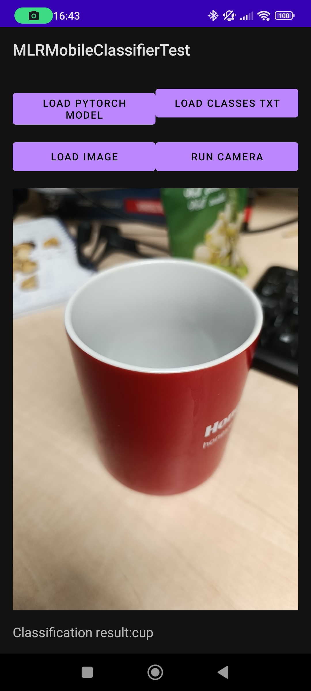

# mobile_classifier_test

[example data](https://drive.google.com/file/d/1TDtsTcT108uPwDhpOQDmy-khTChlYzwK/view?usp=drive_link)

train in colab:

You can run model your model with this .apk:
[android apk](https://drive.google.com/file/d/1vCKXTY8VIV8MtHK-2ncg_hZoCxtV5DEC/view?usp=sharing)

